Mac OS X Build Instructions and Notes
====================================
This guide will show you how to build hempcoind (headless client) for OSX.

Notes
-----

* Tested on OS X 10.7 through 10.10 on 64-bit Intel processors only.

* All of the commands should be executed in a Terminal application. The
built-in one is located in `/Applications/Utilities`.

Preparation
-----------

You need to install XCode with all the options checked so that the compiler
and everything is available in /usr not just /Developer. XCode should be
available on your OS X installation media, but if not, you can get the
current version from https://developer.apple.com/xcode/. If you install
Xcode 4.3 or later, you'll need to install its command line tools. This can
be done in `Xcode > Preferences > Downloads > Components` and generally must
be re-done or updated every time Xcode is updated.

There's also an assumption that you already have `git` installed. If
not, it's the path of least resistance to install [Github for Mac](https://mac.github.com/)
(OS X 10.7+) or
[Git for OS X](https://code.google.com/p/git-osx-installer/). It is ąlso
available via Homebrew.

You will also need to install [Homebrew](http://brew.sh) in order to install library
dependencies.

The installation of the actual dependencies is covered in the Instructions
sections below.
̨̨
Instructions: Homebrew
----------------------

#### Install dependencies using Homebrew

        brew install autoconf automake berkeley-db4 libtool boost miniupnpc openssl pkg-config protobuf qt5 libzmq

### Building `hempcoind`

1. Clone the github tree to get the source code and go into the directory.

        git clone https://github.com/hempcoin-project/hempcoin.git
        cd Hempcoin

2.  Build hempcoind:

        ./autogen.sh
        ./configure --with-gui=qt5
        make

3.  It is also a good idea to build and run the unit tests:

        make check

4.  (Optional) You can also install hempcoind to your path:

        make install

Use Qt Creator as IDE
------------------------
You can use Qt Creator as IDE, for debugging and for manipulating forms, etc.
Download Qt Creator from http://www.qt.io/download/. Download the "community edition" and only install Qt Creator (uncheck the rest during the installation process).

## Prerequisite

Make sure you followed the Homebrew instructions before you proceed with the Qt Creator setup.

Configure the project with `debug enabled`

```bash
./configure --with-gui=qt5 --enable-debug
```

## Qt Creator Project Setup

Launch Qt Creator and select **New Project**

Choose the **Import Project** template and then **Import Existing Project**

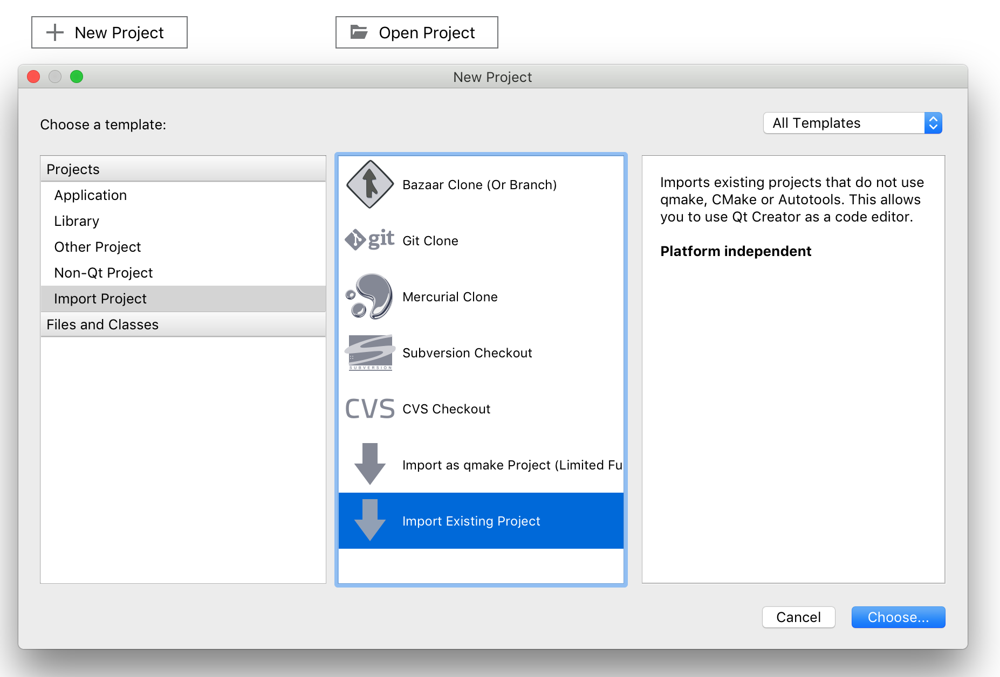

Give you project a **name** and set the **location** to the root of your project.

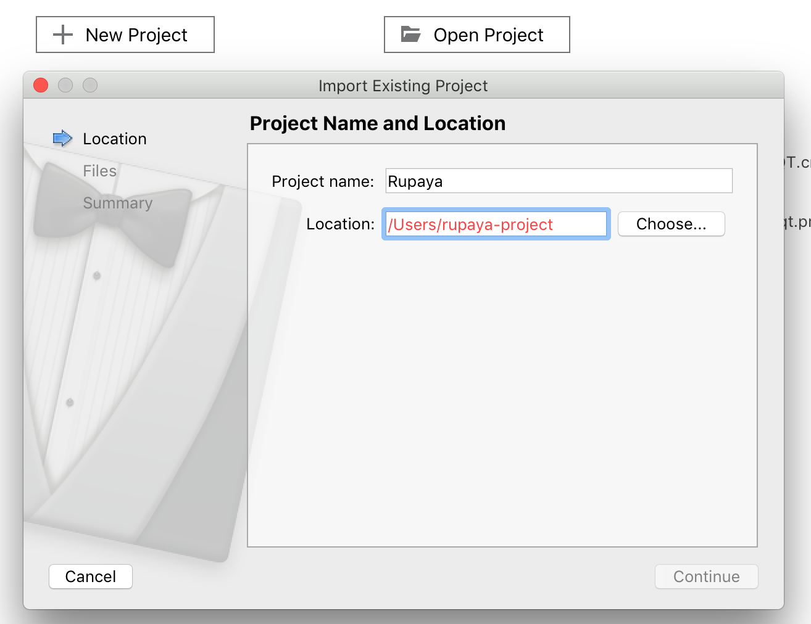

Leave the default file selections as is.

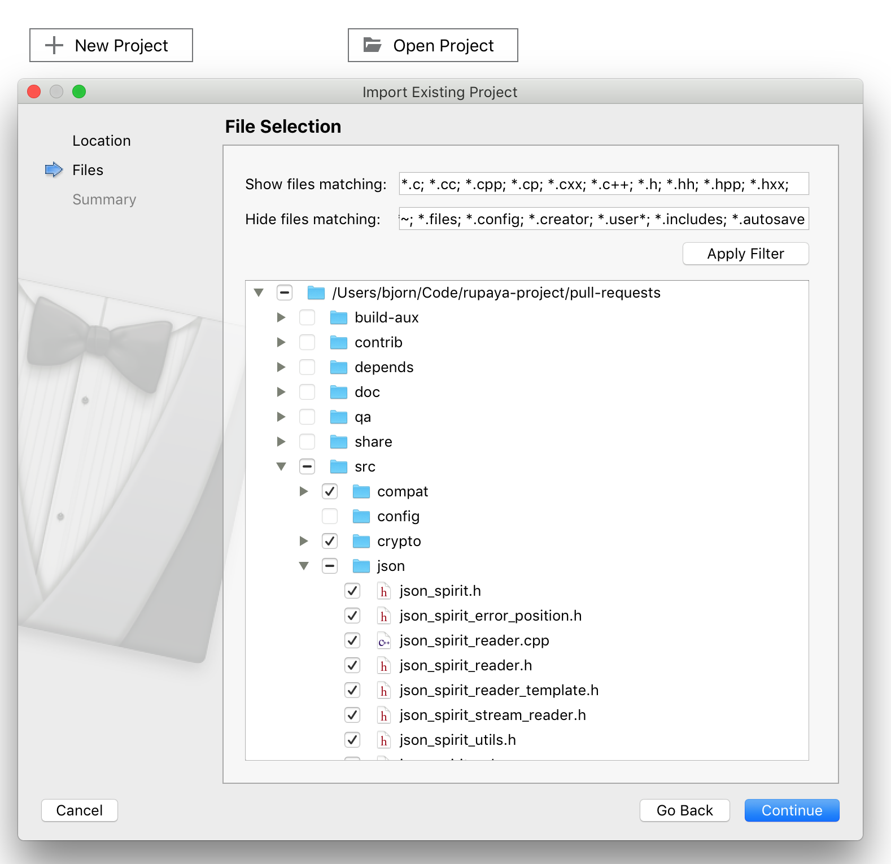

Confirm the summary page. Here you can add your project to Git version control or select `none` if you choose not to.

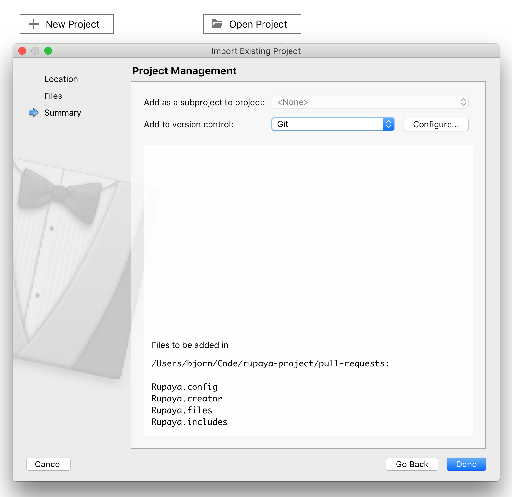

Select **Projects** in the left sidebar and then **Manage Kits**.

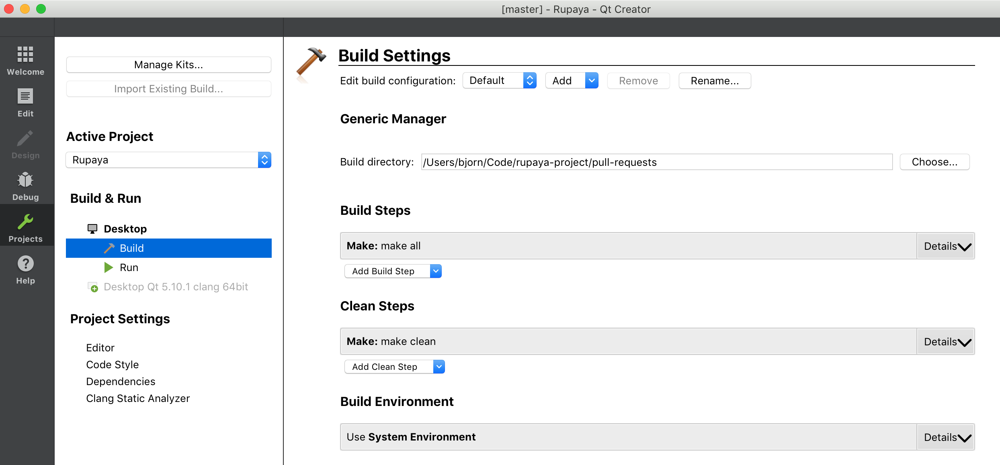

Select the **Desktop (default)** kit and select **Clang (x86 64bit in /usr/bin)** as compiler.

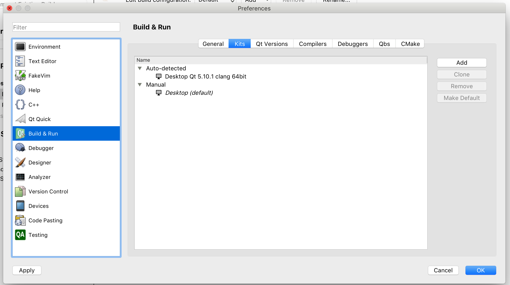


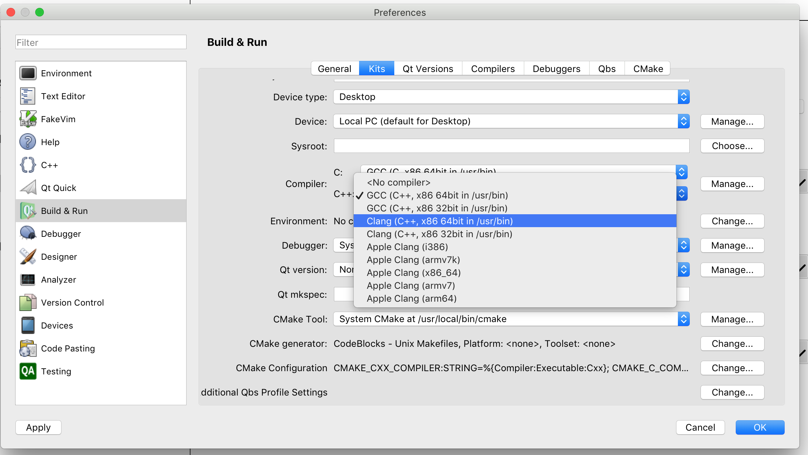

Select **LLDB** as debugger (you might need to set the path to your installtion)

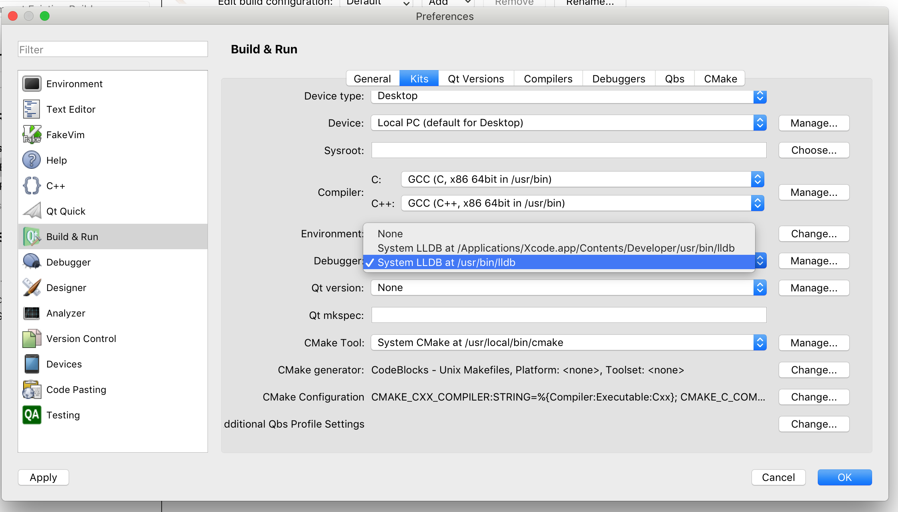

Select **Projects** in the left sidebar and under **Build & Run** choose  **Build**.


Select the **Qt version** and click **Ok**.

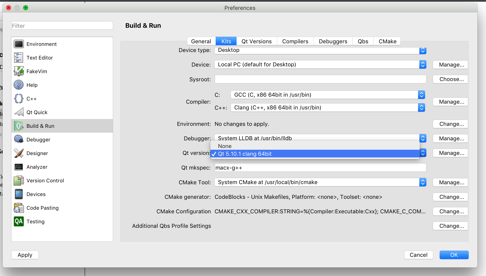

Set the **Build directory** path to the `root` of the clone Hempcoin project. Qt Creator needs this to locate the `Makefile`.


Under **Build & Run** select *Run* and setup a run configuration.

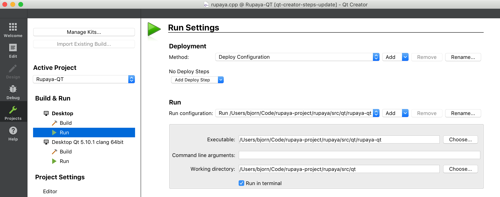

To debug using `testnet`, set `-testnet` as the value of **Command line arguments**. You can pass any other supported wallet arguments here for example setting a custom data directory with `-datadir`.

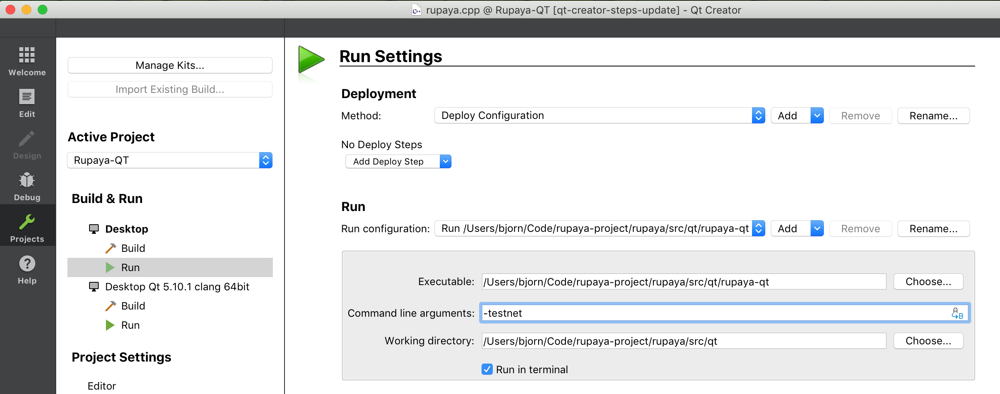

To start debugging, locate the following function in `hempcoin.cpp` and set a breakpoint.

```c++
#ifndef BITCOIN_QT_TEST
int main(int argc, char* argv[])
{
    SetupEnvironment();

    ...
```

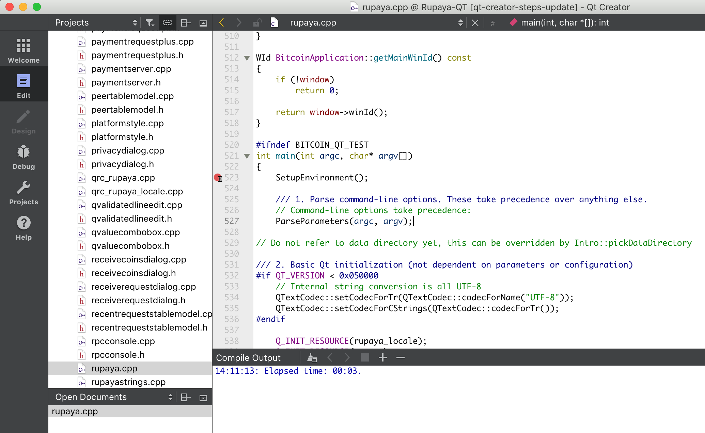

Start your **Debugger**.


Your debugger will stop at the break breakpoint you set.

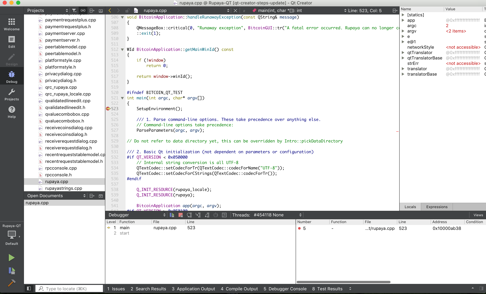

Creating a release build
------------------------
You can ignore this section if you are building `hempcoind` for your own use.

`hempcoind/hempcoin-cli` binaries are not included in the `hempcoin-Qt.app` bundle.

If you are building `hempcoind` or `hempcoin-qt` for others, your build machine should be set up
as follows for maximum compatibility:

All dependencies should be compiled with these flags:

```
 -mmacosx-version-min=10.7
 -arch x86_64
 -isysroot $(xcode-select --print-path)/Platforms/MacOSX.platform/Developer/SDKs/MacOSX10.7.sdk
 ```

Once dependencies are compiled, see release-process.md for how the Hempcoin-Qt.app
bundle is packaged and signed to create the .dmg disk image that is distributed.

Running
-------

It's now available at `./hempcoind`, provided that you are still in the `src`
directory. We have to first create the RPC configuration file, though.

Run `./hempcoind` to get the filename where it should be put, or just try these
commands:

    echo -e "rpcuser=hempcoinrpc\nrpcpassword=$(xxd -l 16 -p /dev/urandom)" > "/Users/${USER}/Library/Application Support/Hempcoin/hempcoin.conf"
    chmod 600 "/Users/${USER}/Library/Application Support/Hempcoin/hempcoin.conf"

The next time you run it, it will start downloading the blockchain, but it won't
output anything while it's doing this. This process may take several hours;
you can monitor its process by looking at the debug.log file, like this:

    tail -f $HOME/Library/Application\ Support/Hempcoin/debug.log

Other commands:
-------

    ./hempcoind -daemon # to start the hempcoin daemon.
    ./hempcoin-cli --help  # for a list of command-line options.
    ./hempcoin-cli help    # When the daemon is running, to get a list of RPC commands
